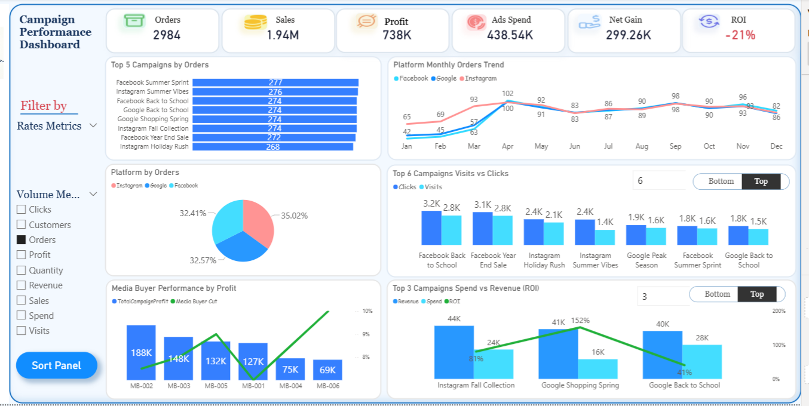
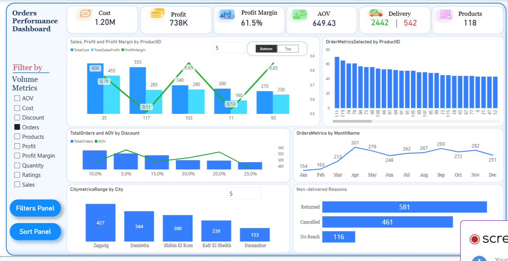
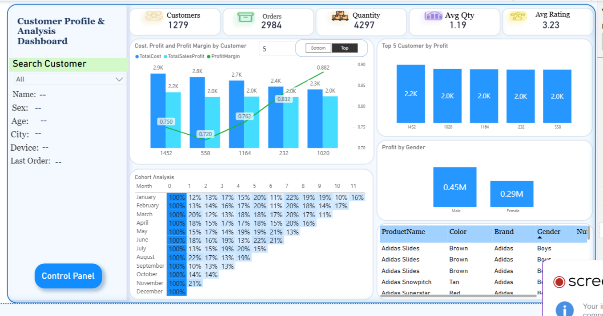

# Marketing & E-commerce Performance Dashboard

## Overview

This project is a three-page Power BI dashboard analyzing the performance of a marketing and e-commerce business. It connects advertising spend to sales outcomes, order behavior, and customer lifetime patterns — giving marketing, operations, and finance teams a single view of what's working, what's wasting money, and which customers are worth keeping. The three pages answer three distinct questions: which campaigns are worth running, how are orders actually performing, and who are the customers behind the revenue.

## Data Source & Scope

The dashboard is built on e-commerce transaction data combined with ad platform data from Facebook, Google, and Instagram. It covers 2,984 orders, 1,279 customers, and 118 products across a full calendar year, with campaign-level attribution linking ad spend to orders and revenue. The data was transformed in Power Query and modeled in Power BI with DAX measures for ROI, profit margin, average order value, customer cohort retention, and time intelligence.

## Dashboard Structure

### 1. Campaign Performance Dashboard

Tracks advertising performance across three platforms and evaluates whether spend is translating into profit.

**Key metrics:**
- Orders: 2,984
- Sales: $1.94M
- Profit: $738K
- Ads Spend: $438.54K
- Net Gain: $299.26K
- ROI: **-21%**

**Visuals:**
- **Top 5 Campaigns by Orders** — led by Facebook Summer Sprint (277), Instagram Summer Vibes (276), Facebook Back to School (274), and several others clustered around 272–274 orders.
- **Platform Monthly Orders Trend** — Facebook, Google, and Instagram order volume by month, showing Facebook leading through most of the year and all three converging in December.
- **Platform by Orders** — Facebook 35.02%, Google 32.57%, Instagram 32.41% — an evenly distributed platform mix.
- **Top 6 Campaigns: Visits vs Clicks** — comparing traffic and engagement across top campaigns like Facebook Back to School (3.2K clicks / 2.8K visits) and Google Peak Season (1.8K / 1.5K).
- **Media Buyer Performance by Profit** — buyers MB-002 through MB-006, ranging from $188K down to $69K in total campaign profit, with a green line tracking media buyer cut percentage.
- **Top 3 Campaigns: Spend vs Revenue (ROI)** — Instagram Fall Collection (81% ROI), Google Shopping Spring (152% ROI), Google Back to School (41% ROI) — Google Shopping Spring is the standout performer.

### 2. Orders Performance Dashboard

Examines order-level profitability, product performance, and delivery outcomes.

**Key metrics:**
- Cost: $1.20M
- Profit: $738K
- Profit Margin: 61.5%
- AOV (Average Order Value): $649.43
- Delivery: 2,442 delivered / 542 not delivered
- Products: 118

**Visuals:**
- **Sales, Profit and Profit Margin by ProductID** — the top 5 products by volume, with margins ranging from 0.51 to 0.85.
- **OrderMetricsSelected by ProductID** — ranking of all products by order volume; product 111 leads, followed by 119 and 79.
- **Total Orders and AOV by Discount** — showing how order volume and average order value shift across discount tiers (10%, 5%, 15%, 30%, 20%, 25%).
- **Orders Metrics by Month Name** — order volume by month, peaking at 301 in March and 293 in September.
- **City Metrics Range by City** — top 5 cities by orders: Zagazig (427), Damietta (344), Shibin El Kom (300), Kafr El Sheikh (239), Damanhur (153).
- **Non-delivered Reasons** — Returned: 581, Cancelled: 461, No Reach: 116. Returns are the largest category of failed delivery.

### 3. Customer Profile & Analysis Dashboard

Analyzes customer behavior, retention, and value across the customer base.

**Key metrics:**
- Customers: 1,279
- Orders: 2,984
- Quantity: 4,297
- Avg Quantity: 1.19
- Avg Rating: 3.23

**Visuals:**
- **Cost, Profit and Profit Margin by Customer** — top 5 customers by volume, with profit margins ranging from 0.72 to 0.88.
- **Top 5 Customers by Profit** — customers ranked by total profit contribution, each generating around $2.0–2.2K.
- **Profit by Gender** — Male: $0.45M, Female: $0.29M.
- **Cohort Analysis** — a retention grid tracking what percentage of each month's customer cohort returns in subsequent months. January's cohort drops to 12% by month 1 but shows recovery in later months (22% by month 6), suggesting a reactivation pattern rather than a simple decay curve.
- **Product Detail Table** — product name, color, brand, and gender target (e.g. Adidas Slides in Brown for Boys).

## Key Insights

- **ROI is negative at -21%.** Ads spend of $438.54K produced a Net Gain of $299.26K, but when the full cost structure is factored in, the marketing operation is not returning a positive ROI. This is the most important number on the dashboard.
- **Google Shopping Spring is the standout campaign** — 152% ROI, more than double the next-best performer. The same buyer running a similar campaign elsewhere should be studied and replicated.
- **Campaign performance is unusually even.** Top campaigns cluster between 268–277 orders, and platform mix is 32–35% each. No single platform is dominating — which is either a sign of healthy diversification or a sign that budget is being spread too thin.
- **Profit margin on orders is strong at 61.5%**, and AOV at $649 suggests solid pricing power at the product level. The problem is upstream, in acquisition cost.
- **Returns are a bigger problem than cancellations.** 581 returned orders vs 461 cancelled — returns alone are worth investigating: are they product quality issues, sizing issues, or logistics damage?
- **Order concentration is geographic.** Zagazig alone accounts for 427 orders — nearly 2x the next city. Expansion opportunities in underperforming cities (Damanhur at 153) could be significant.
- **Customer cohort retention stabilizes around 10–20%** past month 1. The jump back up in months 5–9 suggests a seasonal reactivation effect — worth leaning into with targeted campaigns.
- **Male customers generate more profit ($0.45M vs $0.29M)**, but the female segment is smaller in size — the gap may be a targeting opportunity rather than a preference.

## Recommendations

- **Fix the ROI problem first.** A -21% ROI means every dollar spent on ads is producing less than a dollar back after all costs. Before scaling spend, audit the campaigns with sub-50% ROI and either optimize or cut them.
- **Double down on Google Shopping Spring.** At 152% ROI it's the clearest winner. Replicate the structure, targeting, and creative in other seasons.
- **Investigate returns.** 581 returned orders is a large enough sample to identify a root cause — whether sizing, description accuracy, or delivery damage.
- **Build a reactivation campaign** targeting cohorts at month 5–6, when the data shows retention climbing back up naturally.
- **Explore the female customer segment.** Lower profit but potentially untapped — a targeted campaign could unlock meaningful growth.
- **Reassess discount strategy** — the discount-vs-AOV chart shows AOV doesn't scale consistently with higher discounts, suggesting some discounting is pure margin loss.
- **Expand geographically.** Cities like Damanhur and Kafr El Sheikh show demand but low volume; a targeted local campaign could unlock them.

## Tools & Techniques

- **Power BI Desktop** — three-page dashboard with dynamic filters and sort panels
- **DAX** — KPIs, ROI calculations, profit margin, AOV, cohort retention, time intelligence
- **Power Query** — data transformation and integration from multiple ad platforms
- **Data modeling** — sales, customers, products, campaigns, and time dimensions
- **UI/UX** — dynamic filter panels, sort controls, and smooth page navigation

## Author

Esraa Rashwan — Data Analyst
[GitHub](https://github.com/Esraarashwan) · [LinkedIn](https://www.linkedin.com/in/esraa-rashwan7/) · [Email](mailto:esraa.r2015@gmail.com)