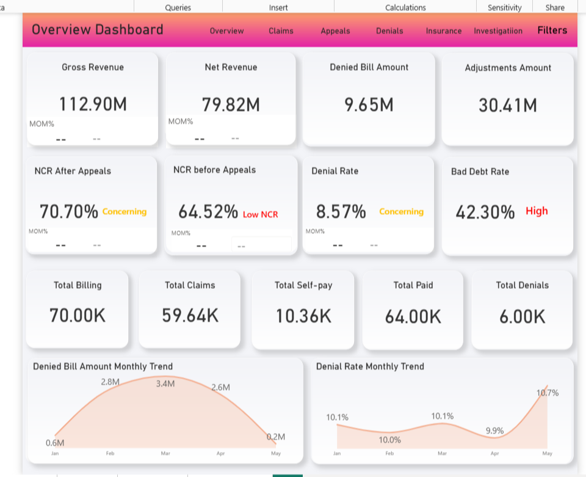
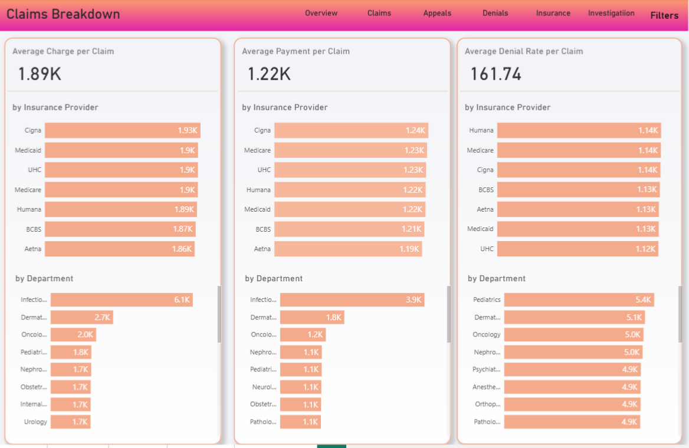
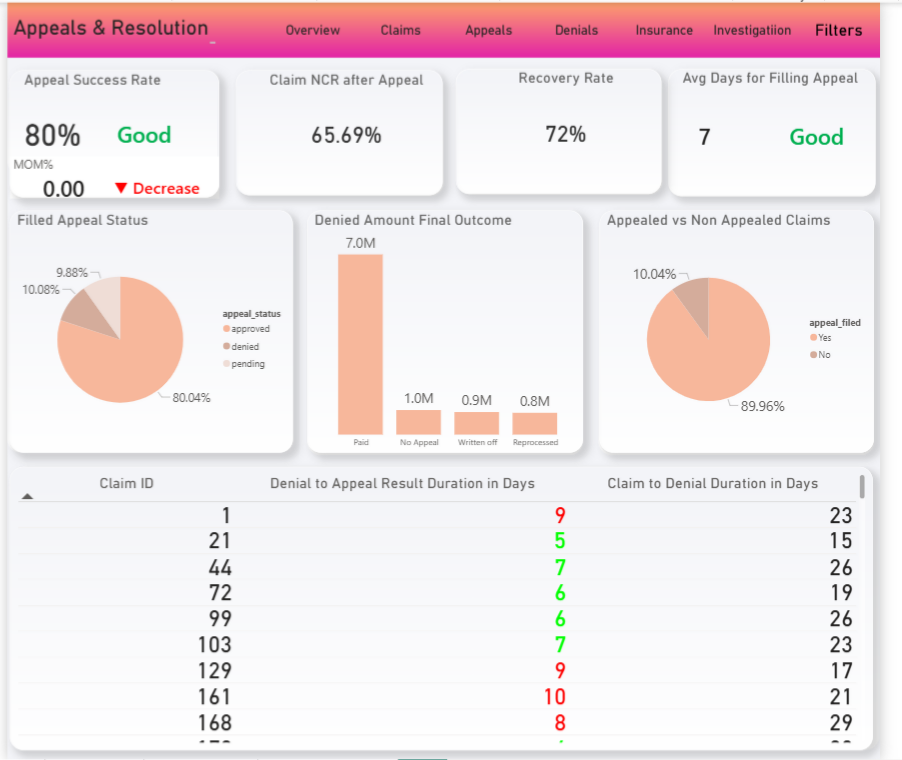
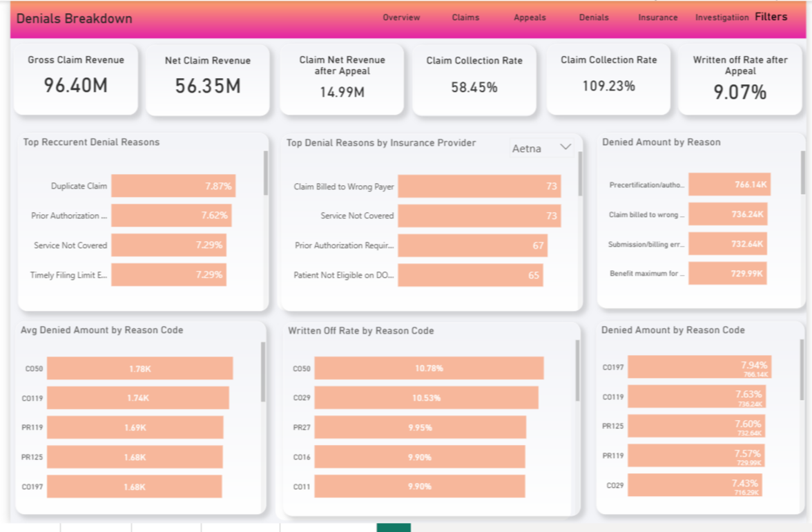
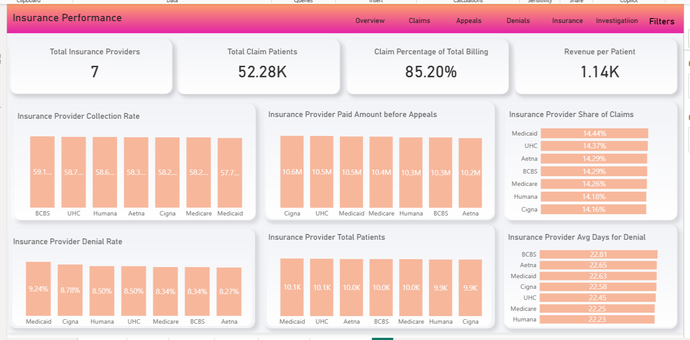
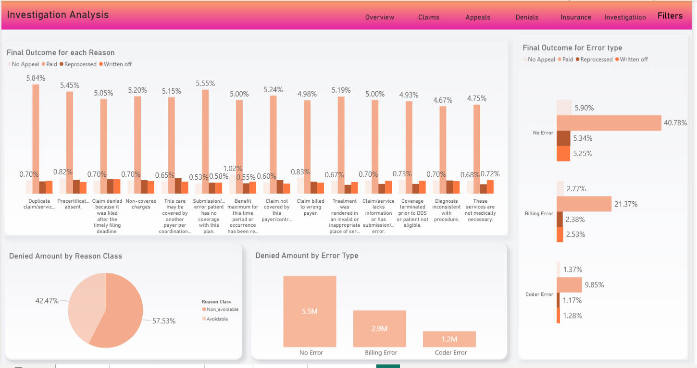

# Healthcare Revenue Cycle Management (RCM) Dashboard

## Overview

This project is a multi-page Power BI dashboard for healthcare Revenue Cycle Management (RCM). It tracks the full claim lifecycle — from billing through payment, denial, appeal, and final resolution — and surfaces where revenue is being lost, why, and what can be done about it. The dashboard is designed for RCM managers, billing teams, and finance leadership who need a clear view of cash flow, denial trends, payer performance, and the effectiveness of the appeals process.

## Data Source & Scope

The dashboard is built on healthcare claims and billing data covering January through May, including roughly 60,000 claims across 7 insurance providers. It combines claim-level detail (charges, payments, adjustments, denial reasons, appeal outcomes) with payer and department dimensions. The dataset was modeled in Power BI with DAX measures for rates, trends, and month-over-month comparisons.

## Dashboard Structure

### 1. Overview

The landing page gives a full financial snapshot of the revenue cycle.

**Key metrics:**
- Gross Revenue: $112.90M
- Net Revenue: $79.82M
- Denied Bill Amount: $9.65M
- Adjustments Amount: $30.41M
- Total Billing: 70.00K
- Total Claims: 59.64K
- Total Self-pay: 10.36K
- Total Paid: 64.00K
- Total Denials: 6.00K

**Performance rates:**
- Net Collection Rate (NCR) after appeals: 70.70% — flagged *Concerning*
- Net Collection Rate before appeals: 64.52% — flagged *Low*
- Denial Rate: 8.57% — flagged *Concerning*
- Bad Debt Rate: 42.30% — flagged *High*

Two monthly trend charts close the page: Denied Bill Amount by month (peaking at $3.4M in February) and Denial Rate by month (rising sharply to 10.7% in May).

### 2. Claims Breakdown

Breaks down average charge, average payment, and average denial rate per claim — both by insurance provider and by department.

**Headline averages:**
- Average charge per claim: $1.89K
- Average payment per claim: $1.22K
- Average denial rate per claim: $161.74

The page shows which payers reimburse the highest (Cigna at $1.93K per claim) and which departments generate the highest charges (Infectious Disease at $6.1K, Dermatology at $2.7K, Oncology at $2.0K).

### 3. Appeals & Resolution

Measures how effective the appeals process is at recovering denied revenue.

**Key metrics:**
- Appeal Success Rate: 80% — rated *Good*
- Claim Net Collection Rate after appeal: 65.69%
- Recovery Rate: 72%
- Average days to file an appeal: 7 — rated *Good*

The visuals show that 89.96% of denied claims are appealed, 80.04% of filed appeals are approved, and of the $9M+ in denied amounts, $7.0M was eventually paid — with smaller portions written off or reprocessed. A detailed table lists the days from denial to appeal result and from claim to denial for individual claim IDs.

### 4. Denials Breakdown

Analyzes why claims are denied and how much money each denial reason costs.

**Financial impact:**
- Gross Claim Revenue: $96.40M
- Net Claim Revenue: $56.35M
- Claim Net Revenue after Appeal: $14.99M
- Claim Collection Rate: 58.45%
- Claim Collection Rate after Appeal: 109.23%
- Written-off Rate after Appeal: 9.07%

**Top denial reasons:**
1. Duplicate Claim — 7.87%
2. Prior Authorization — 7.62%
3. Service Not Covered — 7.29%
4. Timely Filing Limit — 7.29%

The page also breaks down denial reasons by payer (e.g. Aetna's top reasons: Claim Billed to Wrong Payer, Service Not Covered, Prior Authorization Required) and shows the highest-impact reason codes by both average denied amount and write-off rate.

### 5. Insurance Performance

Compares the 7 insurance providers across every dimension that matters for revenue collection.

**Key metrics:**
- Total insurance providers: 7
- Total claim patients: 52.28K
- Claim percentage of total billing: 85.20%
- Revenue per patient: $1.14K

**Payer comparisons:**
- Collection rate: highest BCBS at 59.1%, lowest Medicaid at 57.7%
- Paid amount before appeals: Cigna highest at $10.6M, Aetna lowest at $10.2M
- Share of claims: Medicaid 14.44%, UHC 14.37%, Aetna 14.29%, BCBS 14.29%, Medicare 14.26%, Humana 14.18%, Cigna 14.16% — evenly distributed
- Denial rate: Medicaid highest at 9.24%, Aetna lowest at 8.27%
- Average days to denial: BCBS slowest at 22.81 days, Humana fastest at 22.23 days

### 6. Investigation Analysis

Identifies where denials are avoidable and separates them from unavoidable ones.

**Key findings:**
- 57.53% of denied amount is **avoidable**
- 42.47% is unavoidable

**By error type:**
- No Error: $5.5M
- Billing Error: $2.9M
- Coder Error: $1.2M

The final-outcome chart shows, for each denial reason, what happened after appeal — how much was paid, reprocessed, or written off. Billing errors represent the largest recoverable opportunity, while Coder Errors carry the highest write-off rate.

## Key Insights

- **Denial rate is trending up** — from 9.9% in April to 10.7% in May, a sharp increase that needs attention.
- **Appeals are working** — 80% success rate and a 72% recovery rate, but there's still a 9.07% write-off rate after appeal.
- **Bad Debt Rate of 42.30%** is the most alarming number in the dashboard.
- **Over half of denied revenue (57.53%) is avoidable** — a clear target for process improvement.
- **Duplicate Claims and Prior Authorization issues** are the top two denial reasons, both largely preventable.
- **Payers are remarkably balanced** in claim share (14–14.4% each), so there's no single payer driving the problem — it's systemic.
- **The gap between NCR before appeal (64.52%) and after appeal (70.70%)** shows appeals recover meaningful revenue but don't close the gap.

## Recommendations

- **Fix duplicate claim submissions** — the single most common denial reason and entirely preventable with a front-end claims scrubber.
- **Strengthen prior authorization workflows** — the second-biggest reason and a known source of avoidable denials.
- **Reduce bad debt** by tightening self-pay collection processes earlier in the cycle.
- **Investigate the May spike** in denial rate — if a specific payer or department caused it, address that directly.
- **Automate appeal tracking** — the current 7-day average is good, but shortening it further recovers cash faster.
- **Target the 57.53% avoidable denials** — even recovering half of them would materially move net revenue.

## Tools & Techniques

- **Power BI Desktop** — dashboard design and visualization
- **DAX** — rate calculations, month-over-month comparisons, conditional formatting
- **Power Query** — data transformation and modeling
- **Data modeling** — claims, payers, departments, and time dimensions

## Author

Esraa Rashwan — Data Analyst
[GitHub](https://github.com/Esraarashwan) · [Linkedin](https://www.linkedin.com/in/esraa-rashwan7/) · [Email](esraa.r2015@gmail.com)