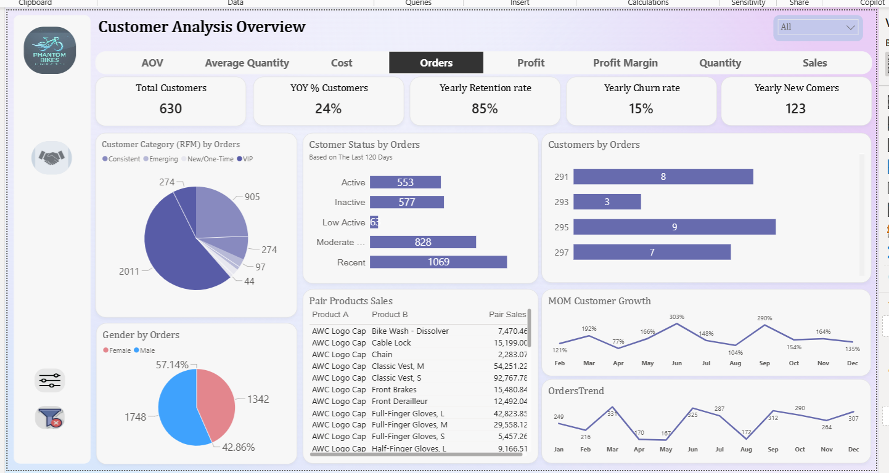
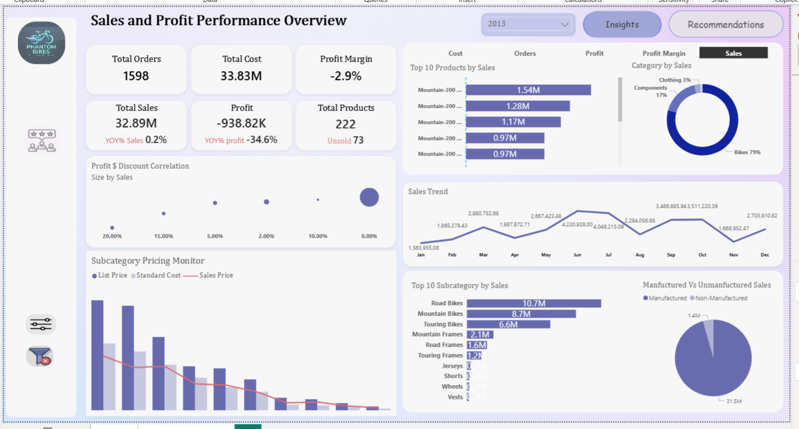

# Sales & Customer Insights Dashboard

## Overview

This project is a two-page Power BI dashboard analyzing sales and customer behavior for **Phantom Bikes**, a bicycle manufacturer. It covers two years of sales data and answers two questions: how is the business performing financially, and who are the customers driving that performance? The dashboard supports the sales, marketing, and finance teams in making pricing, discounting, and customer retention decisions.

## Data Source & Scope

The dashboard is built on two years of transactional sales data (2012–2013) covering 1,598 orders, 222 products, and 630 customers. Data includes product pricing (list price, standard cost, sales price), customer attributes (gender, activity status, retention/churn), order-level detail, and time dimensions. The dataset was modeled in Power BI with advanced DAX for RFM segmentation, retention and churn calculations, market basket analysis, and year-over-year / month-over-month time intelligence.

## Dashboard Structure

### 1. Customer Analysis Overview

The first page focuses on who the customers are, how they behave, and how the customer base is evolving.

**Key metrics:**
- Total Customers: 630
- Year-over-Year Customer Growth: 24%
- Yearly Retention Rate: 85%
- Yearly Churn Rate: 15%
- Yearly New Customers: 123

**Visuals:**
- **Customer Category (RFM) by Orders** — segments customers into Consistent, Emerging, New/One-Time, and VIP using a dynamic RFM (Recency, Frequency, Monetary) model. VIP customers account for the largest share of orders.
- **Customer Status by Orders** — last 120 days of activity broken into Active, Inactive, Low Active, Moderate, and Recent. Recent customers lead at 1,069 orders.
- **Customers by Orders** — top customers ranked by order count.
- **Gender by Orders** — 57.14% male, 42.86% female.
- **Pair Products Sales** — top product pairs bought together (e.g. AWC Logo Cap + Classic Vest S: 92,767.78), built with DAX-driven market basket analysis to support cross-selling.
- **MOM Customer Growth** — month-over-month growth, peaking at 303% in June.
- **Orders Trend** — monthly order volume across the year, peaking at 326 in June and dipping to 172 in August.

### 2. Sales and Profit Performance Overview

The second page examines financial performance — where the money is made, and where it's being lost.

**Key metrics:**
- Total Orders: 1,598
- Total Cost: $33.83M
- Profit Margin: **-2.9%** (negative)
- Total Sales: $32.89M
- Profit: **-$938.82K** (loss)
- Total Products: 222 (73 unsold)
- Year-over-Year Sales Growth: +0.2%
- Year-over-Year Profit Growth: **-34.6%**

**Visuals:**
- **Top 10 Products by Sales** — dominated by Mountain Bike models, each contributing $0.97M–$1.54M.
- **Profit Margin Category by Sales** — Bikes represent 81% of category sales, with Components at 17% and Clothing at 3%.
- **Profit $ Discount Correlation** — scatter plot showing that higher discounts do **not** correlate with higher sales.
- **Sales Trend** — monthly sales across the year, peaking at $3.51M in October.
- **Subcategory Pricing Monitor** — compares list price, standard cost, and sales price across subcategories.
- **Top 10 Subcategories by Sales** — Road Bikes ($10.7M), Mountain Bikes ($8.7M), Touring Bikes ($6.6M).
- **Manufactured vs Non-Manufactured Sales** — manufactured products account for $31.5M of the $32.89M total.

## Key Insights

- **The business has a profitability problem, not a sales problem.** Sales grew 0.2% year-over-year, but profit dropped 34.6% — the loss came from margin erosion, not weak demand.
- **Discounts are not driving sales.** The discount-vs-profit correlation chart shows no relationship between higher discounts and higher sales volume. Discounts are cutting into margin without bringing in more revenue.
- **Bikes are 81% of category sales** — and they're the category absorbing the heaviest discounting. The pricing strategy on the highest-selling category deserves the most scrutiny.
- **High-cost manufactured products + unnecessary discounts = negative profit** despite solid sales growth.
- **Retention is strong at 85%**, so the customer base isn't the problem — the pricing on what they buy is.
- **73 of 222 products have never sold.** A meaningful chunk of the catalog isn't earning its place.

## Recommendations

**Key recommendation:**

The core problem is **pricing and discount strategy**. High discounts on Bikes are eroding margins without stimulating additional demand. The business should consider:

- **A discount audit** — remove or reduce discounts where sales already happen naturally.
- **Margin recovery in high-cost months** like June, when production costs peak and discounting compounds the loss.
- **Review the 73 unsold products** — either reposition, bundle, or discontinue them.
- **Protect the 85% retention rate** — the customer base is healthy; the pricing on what they buy is not.
- **Shift focus from sales volume to profit per product category** — track profit margin by subcategory as a primary KPI, not just revenue.

## Tools & Techniques

- **Power BI Desktop** — dashboard design, bookmark navigation, selection panes for smooth UX
- **Advanced DAX** — dynamic RFM segmentation, retention and churn rate calculations, market basket analysis (product pairs), YOY and MOM time intelligence
- **Data modeling** — star schema with sales, products, customers, and date dimensions
- **UI/UX** — bookmarks and selection panes for smooth navigation between views

## Author

Esraa Rashwan — Data Analyst
[GitHub](https://github.com/Esraarashwan) · [LinkedIn](https://www.linkedin.com/in/esraa-rashwan7/) · [Email](mailto:esraa.r2015@gmail.com)